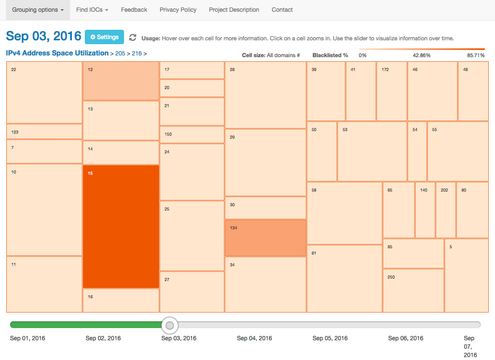

# THACO (THreat Analysis COnsole)

THACO is an open source threat analysis console for DNS-based network threat analysis grounded in both an understanding of network threat analysts’ needs and tasks and security visualization best practices. The proposed open source threat analysis console, called THACO (THreat Analysis COnsole), leverages open DNS datasets, domain WHOIS records, and both public malware and domain blacklists. It also uses a visually scalable visualization technique, a multi-grouping, zoomable treemap, to adapt to DNS-based network threat analysis needs.

[](https://ipviz.gtisc.gatech.edu/)


## Publications

[Towards Designing Effective Visualizations for DNS-based Network Threat Analysis](thaco.pdf);
Rosa Romero-Gómez, Yacin Nadji, and Manos Antonakakis;
To be published at IEEE VizSec 2017 (Best Paper Award).

## Demo

For a live demo of THACO, please go to: https://ipviz.gtisc.gatech.edu/. 


## Datasets

Due to passive DNS datasets are challenging to collect and often rquire restrictive legal agreements, THACO leverages open active DNS datasets in combination with public domain blacklists such as Abuse.ch, malware blacklists such as Malware DL, and domain WHOIS records from VirusTotal. To request access to active DNS datasets, please contact: access@activednsproject.org. For further information about the Active DNS project, please go to: https://www.activednsproject.org/.


## Getting Started

### Prerequisites

- Download and install [node.js](http://nodejs.org) version 6+.
- Although, node comes with npm, the project is using an NPM alternative called [Yarn](https://yarnpkg.com/). Yarn API is almost the same as NPM but it is much faster and it better handles version conflicts. So, please use Yarn instead of NPM client.
- Download, install, and run [MongoDB 3.4.x](https://www.mongodb.com/download-center?jmp=nav#community). For further information about the input format and how to load data in mongodb, please check the folder `/app/scripts` and `/app/scripts/README.md` for more info.
- Download, install, and run [PostGresSQL](https://www.postgresql.org/download/). Check which is the appropriate package according to your operating environment. 
For further information about how to create the PostGresSQL database, check the folder `/app/scripts` and `/app/scripts/README.md` for more info. You should also adapt the connection to your database in `app/src/server/main.js`.

### Download

```shell
git clone https://github.com/Astrolavos/THACO.git
cd THACO/app
yarn install #installs all deps
cd THACO/app/node_modules/geoip-lite && yarn run updatedb #inits GEO library
```

### Development mode

At this point, you should have already running your PostGresSQL database.

```shell
ssh -L 5432:yourMachineIP:5432 USERNAME@yourMachineName #opens a ssh tunnel for the Postgres database if it is running in a different machine than the application.
yarn start
open http://localhost:8000
```

### Production mode (for local testing)

```shell
yarn run build
yarn run server
open http://localhost:8000
```

### Unit tests

```shell
yarn test
```

### ESLint

```shell
yarn run lint
```

## The Front End Architecture

This part describes how we built an user interface (front end) for this app. You can skip this if you are already familiar with React and the related ecosystem. Today's JavaScript applications are like onions. They have way too many layers and make you cry. Unfortunately, this app has a lot of layers as well but it should not make you cry once you get more familiar with it. In fact, it's using same state-of-the-art patterns that are used by companies like Facebook, Netflix or Airbnb (in 2016). Admittedly, there is a big entry barrier for programmers but once you are familiar it will allow you to build even very complex UIs with ease and keep your codebase sane. If you plan to make significant changes you will need to learn basics of multiple libraries.

### Used libraries
- [React](https://facebook.github.io/react/) - React is a functional way to describe UI components. It's what you can see and interact with.
- [React-router v3](https://github.com/ReactTraining/react-router) - Routing, Links, Navigation...
- [Redux](http://redux.js.org) - Pretty minimalistic library but introduces a powerful pattern to control data flow in your applications, keeps the whole app state in one place
- [Redux-saga](https://github.com/yelouafi/redux-saga) - A redux middleware that helps with async side-effects (in our case communication with the server) while using generators
- [Immutable](https://facebook.github.io/immutable-js/) - Immutable collection for JavaScript, the whole app state is immutable - makes it easier to reason about things and brings some extra performance

There are some smaller, less significant libraries, that help with stuff like bundling ([webpack](https://webpack.js.org)) or testing ([ava](https://github.com/avajs/ava)). Also, you should be comfortable with the latest JavaScript ES2015 and features like generators and promises. On the other hand, don't worry too much about inheritance. This app is written in a functional way, embracing composition over inheritance.

### Folder structure

- src - all source codes
  - client - everything that runs in browsers
    - actions - action creators, functions creating and handling side effects (especially async flow) using redux-saga
    - components - all React components, everything that you can actually see and interact with, it maps the app state (data) into UI
    - reducers - all reducers
    - styles - stylesheets and fonts
    - api.js - all available API calls (functions that return promises), higher and cleaner abstraction
    - apiMethods.js - using fetch API, this actually makes the API calls, some error handling, setting headers, the lowest (first) abstraction
    - configureStore.js - the central point of redux, it creates the store object, holds the app state, adds additional middlewares
    - constants.js - all constants, contains all action types that user or server can fire, options (colors...) for the treemap
    - index.js - the starting point, it calls configureStore and attaches React components to the DOM
    - main.js - the top React component, list of routes, routes are just another React components
    - sagaManager.js - starts saga's watchers, hot reload sagas
    - utils.js - some handy functions like data formatting
  - server - API etc., described below...
- test - tests
- webpack - webpack configuration, dev server, production vs development mode
- .babelrc - babel is a JS transpiler, ES2015/next into ES5, so it works in all browsers
- .eslintrc - set of rules for linting, keeps your code neat
- .gitignore
- package.json - defines all dependencies (libraries) and scripts (to run it, test it, build it...)
- README.md - instructions how to get the app running
- yarn.lock - autogenerated by yarn, keeps track of dep versions

### Tips & Tricks

- Use Chrome while developing. Download and use super helpful [Redux DevTools](https://chrome.google.com/webstore/detail/redux-devtools/lmhkpmbekcpmknklioeibfkpmmfibljd?hl=en) - it shows you what actions are fired, how's the app state changing, enables time traveling (rewinding actions)...
- Try [React Developer Tools](https://chrome.google.com/webstore/detail/react-developer-tools/fmkadmapgofadopljbjfkapdkoienihi?hl=en), shows you React component props, not so useful as Redux DevTools since there are rarely errors with React components.
- Keep your Chrome console open, it will tell you useful stuff! When you make a change and save it, the most of times you don't have to refresh the page because almost everything is magically hot reloaded (works for React components, sagas/action creators and reducers). Webpack always tells you (through the console) when refresh is needed.
- If you are still confused, get a cup of coffee and reread Redux docs. It's well-written and precisely describes how this app works at high-level (the lifecycle of actions and data...).

## The Server & API architecture

The server part is completely independent on the front-end. So, you if you are sick of React and all those libraries you can build whatever application using the API. Anyway, the server part is much easier than front-end. Again, make sure you truly understand how node.js handles I/O operations (in our case queries to Mongo and Postgres). It's a common trap if you come from languages like Java. Keywords: callbacks, promises, generators (all used on front-end as well). The async/non-blocking characteristic of node it's the reason why it is extremely fast even when it's using only single-core but it's harder for programmers.

**Tip:** When you make some change on the server, you have to stop the process and run

```
yarn start
```

again to reflect it.

### Files

- db.js - Initializes the connection with mongo and defines schema of its documents
- html.js - Basic HTML template that is server to user when she first visits the website, it's also using React since React works on server-side as well
- index.js - require hook for Babel.js so we can use all features from ES2015+ on server too
- main.js - connection to Postgres, all APIs
- utils.js - some helper functions
- virustotal.js - endpoint for our IP report that goes through VirusTotal API first

### APIs

```
/api/v1/item/:uid
```

Returns the treemap (UID encodes specific day & ip/prefix, it's an _id in MongoDB:items)

```
/api/v1/links
```

Returns the list of root IDs for all "days x IP/GEO/AS" pairs. The thing you can see when you are changing the date.

```
/api/v1/ip_report/:ip
```

Pings VirusTotal API. It returns all sort of stuff about IP (especially malware samples).


```
/api/v1/info/:day/:ip
```

Returns details about the IP/day (numbers of domains, GEO information...).

```
/api/v1/domains/:day/:ip[?search=XXX&offset=0&limit=50]
/api/v1/blacklisted_domains/:day/:ip[?search=XXX&offset=0&limit=50]
/api/v1/new_domains/:day/:ip[?search=XXX&offset=0&limit=50]
```

Returns domains (from our Postgres database) for a specific day and IP. There are 3 different endpoints (all domains, blacklisted domains, new domains for last 24 hours). You can also specify `search` for domain names. `offset` and `limit` can be used for paging.


